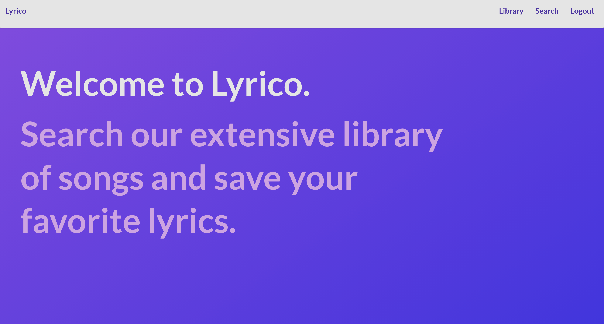
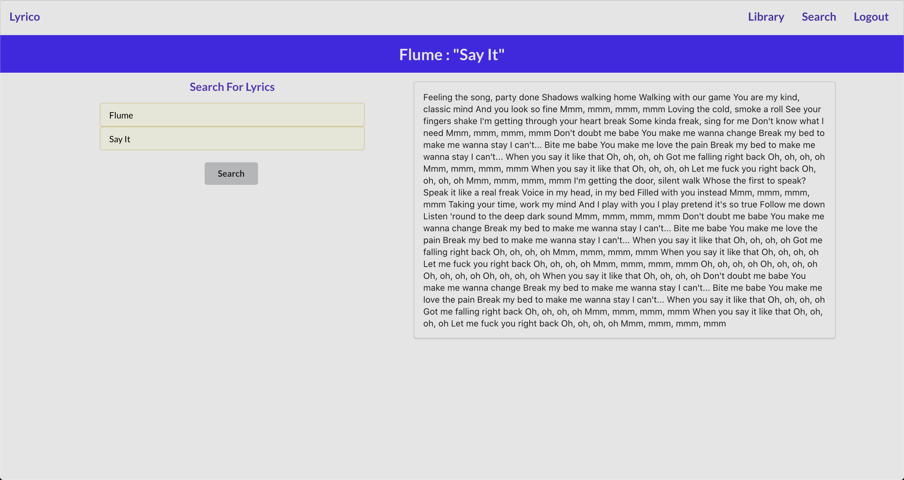
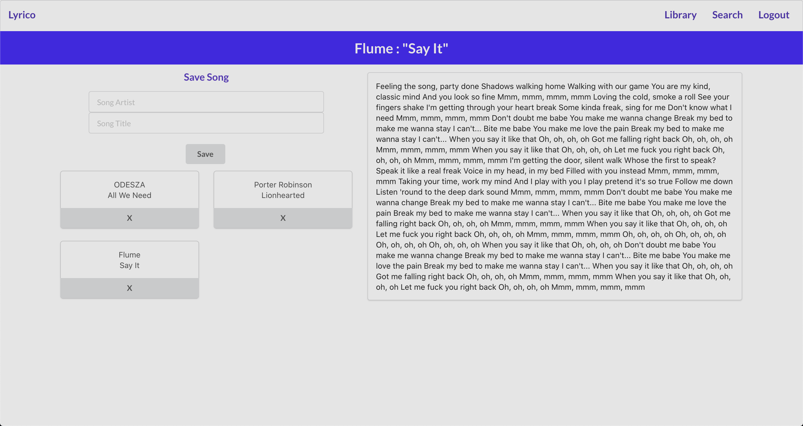

# Lyrico

Lyrico allows users to find the lyrics to an extensive list of songs. Users can also make an account to easily access the lyrics to songs they save. 

## Screenshots

## Technologies Used
* React
* Express
* MongoDB
* Node
* Javscript
* Heroku
* CSS
* HTML

## Getting Started
App: https://lyricoapp.herokuapp.com/

Trello: https://trello.com/b/8FMVUKVH/project-4-lyrico

# Next Steps
* Users can use a search bar for more flexibility when finding songs
* More loads with the lyrics
  * Youtube video, release year, etc
